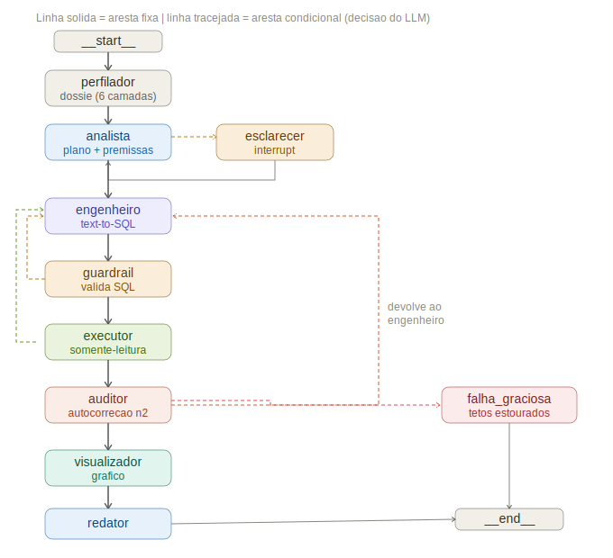

# d1_assistente_dados_PROJETO_FINAL

**Assistente Virtual de Dados — Multiagêntico.** Um sistema **text-to-SQL agêntico** sobre LangGraph + Gemini: você pergunta em linguagem natural, e uma equipe de agentes planeja a consulta, escreve o SQL, executa contra o banco, audita se o resultado realmente responde à pergunta e devolve uma resposta de negócio com o gráfico mais adequado — mostrando, a cada passo, *como* chegou lá.

> **A tese do projeto, em uma frase:** *no Desafio 2 a incerteza estava nos dados, e usei um pipeline com LLM em pontos fixos; no Desafio 1 a incerteza está na pergunta e no caminho, então inverti — dei agência ao LLM onde ela é necessária, mantendo determinismo onde ela é perigosa.*

Desafio Técnico — FRANQ · Autor: **Leandro Henrique da Silva** (Eng. de Controle e Automação).

---

## Sumário

- [1. Instruções de execução](#1-instruções-de-execução)
  - [1.1. Baixar o projeto pelo Git](#11-baixar-o-projeto-pelo-git)
  - [1.2. Python 3.12](#12-python-312)
  - [1.3. Ambiente virtual](#13-ambiente-virtual)
  - [1.4. Dependências](#14-dependências)
  - [1.5. As chaves de API — o arquivo `.env`](#15-as-chaves-de-api--o-arquivo-env)
  - [1.6. Rodar](#16-rodar)
- [2. Fluxo de agentes e arquitetura escolhida](#2-fluxo-de-agentes-e-arquitetura-escolhida)
- [3. Exemplos de consultas testadas](#3-exemplos-de-consultas-testadas)
- [4. Sugestões de melhorias e extensões](#4-sugestões-de-melhorias-e-extensões)
- [Documento Executivo](#documento-executivo)
- [Autor](#autor)

---

## 1. Instruções de execução

> Siga **nesta ordem**. Ao final, o ambiente estará baixado, instalado, configurado e rodando. Todos os comandos são para **PowerShell no Windows**, executados na **raiz do projeto** (a pasta que contém `app/`, `requirements.txt` e `langgraph.json`).

### 1.1. Baixar o projeto pelo Git

Pré-requisito: ter o **Git** instalado (<https://git-scm.com/download/win>). Confirme com `git --version`.

Na pasta onde você quer guardar o projeto, clone o repositório público:

```powershell
git clone https://github.com/lhs91/d1_assistente_dados_PROJETO_FINAL.git
cd d1_assistente_dados_PROJETO_FINAL
```

O `git clone` baixa todo o projeto e cria a pasta `d1_assistente_dados_PROJETO_FINAL`; o `cd` entra nela. A partir daqui, todos os comandos rodam dessa raiz.

> Alternativa sem Git: na página do repositório no GitHub, clique em **Code → Download ZIP**, extraia, e abra o PowerShell dentro da pasta extraída.

Confira que está na raiz certa — este comando deve listar o arquivo:

```powershell
dir langgraph.json
```

### 1.2. Python 3.12

O projeto requer **Python 3.12**. Baixe em <https://www.python.org/downloads/release/python-3120/> (instalador do Windows) e, na instalação, marque **"Add python.exe to PATH"**. Confirme:

```powershell
py -3.12 --version
```

Deve exibir `Python 3.12.x`.

### 1.3. Ambiente virtual

Crie e ative um ambiente isolado com o Python 3.12:

```powershell
py -3.12 -m venv .venv
.\.venv\Scripts\Activate.ps1
```

Ativado, o prompt mostra `(.venv)`. Se o PowerShell bloquear a ativação, rode uma vez `Set-ExecutionPolicy -Scope Process -ExecutionPolicy Bypass` e ative de novo. **Mantenha o `.venv` ativo** nos próximos passos.

### 1.4. Dependências

```powershell
pip install -r requirements.txt
```

### 1.5. As chaves de API — o arquivo `.env`

O sistema lê as chaves de um arquivo chamado **`.env`** na **raiz do projeto** (ao lado de `langgraph.json`). Você **não edita nenhum código** — apenas cria esse `.env` e cola suas chaves nele; o código o carrega automaticamente.

#### Obtenha as chaves

- **Google Gemini (obrigatória):** acesse <https://aistudio.google.com/apikey>, faça login, clique em **"Create API key"** e **copie** a chave (começa com `AIza...`). Sem ela o sistema não chama o modelo.
- **LangSmith (opcional, só observabilidade):** acesse <https://smith.langchain.com>, vá em **Settings → API Keys → Create API Key** e copie a chave (começa com `lsv2_...`). Crie um projeto chamado **`d1_franq`** (é o nome que o código usa para registrar os traces).

#### Crie o `.env` e cole as chaves — Caminho A (Bloco de Notas, recomendado)

Na raiz do projeto, com o PowerShell aberto ali:

```powershell
notepad .env
```

O Bloco de Notas pergunta *"Deseja criar um novo arquivo?"* — clique em **Sim**. Na janela em branco, **cole** o conteúdo abaixo e **substitua o texto após cada `=` pela sua chave real** (apague o `cole_aqui_...` e cole a chave que você copiou):

```dotenv
GOOGLE_API_KEY=cole_aqui_a_chave_do_google_ai_studio
LANGSMITH_API_KEY=cole_aqui_a_chave_do_langsmith
```

Após colar, a primeira linha deve ficar parecida com `GOOGLE_API_KEY=AIzaSyC...`.

**Atenção a um detalhe do Windows:** o Bloco de Notas tende a salvar como `.env.txt` (com `.txt` escondido), e aí o sistema não acha o arquivo. Para evitar, use **Arquivo → Salvar como**, no campo **"Tipo"** escolha **"Todos os arquivos (*.*)"**, e confirme o nome como exatamente **`.env`** (com o ponto na frente). Confira:

```powershell
dir .env
```

Deve listar **`.env`**. Se aparecer `.env.txt`, renomeie: `Rename-Item .env.txt .env`.

#### Caminho B (direto pelo PowerShell, sem editor)

Cria e preenche numa tacada, sem o risco do `.txt` escondido (troque pelos valores reais):

```powershell
"GOOGLE_API_KEY=AIzaSyC...sua_chave_real"    | Out-File -FilePath .env -Encoding utf8
"LANGSMITH_API_KEY=lsv2_pt_...sua_chave"     | Out-File -FilePath .env -Append -Encoding utf8
```

#### Regras de ouro do `.env`

- O arquivo se chama **`.env`** (só isso, com o ponto inicial) e fica na **raiz**, ao lado de `langgraph.json`. Dentro de `app/` não funciona.
- Cada linha é `CHAVE=valor`, **sem espaços ao redor do `=`** e **sem aspas**. Certo: `GOOGLE_API_KEY=AIza...`. Errado: `GOOGLE_API_KEY = "AIza..."`.
- O `.env` **nunca** é versionado (está no `.gitignore`); cada pessoa coloca a sua própria chave.

### 1.6. Rodar

Com o ambiente ativo e o `.env` configurado, **na raiz do projeto**:

**Primeiro PowerShell** — testes e interface:

```powershell
pip install -r requirements.txt
pytest
taskkill /F /IM streamlit.exe
streamlit run app/interface.py --server.port 5555
```

O `pytest` roda a suíte (**232 testes**). O `taskkill` encerra instâncias antigas do Streamlit presas em portas anteriores (se não houver nenhuma, ele só avisa — pode prosseguir). O último comando sobe a interface no navegador.

**Segundo PowerShell** (opcional) — LangGraph Studio, na mesma raiz:

```powershell
langgraph dev --config langgraph.json
```

> O Studio é **opcional**. A observabilidade no LangSmith (projeto `d1_franq`) já funciona com o `streamlit run` acima, desde que a `LANGSMITH_API_KEY` esteja no `.env`.

**CLI** (sem interface), para uma pergunta avulsa ou a bateria do enunciado:

```powershell
python -m app.principal "Qual o número de reclamações não resolvidas por canal?"
python -m app.bateria
```

Inspeção do banco (opcional): `python ver_banco_d1.py "caminho\para\data\anexo_desafio_1.db"`.

---

## 2. Fluxo de agentes e arquitetura escolhida

O sistema é um **grafo multiagêntico** (LangGraph): cada etapa é um papel especializado, com loops de autocorreção e um plano de controle determinístico em volta. O diagrama abaixo é a topologia real do grafo compilado.



*Linha sólida = aresta fixa. Linha tracejada = aresta condicional (a decisão nasce em um agente). As arestas em amarelo mostarda são os retornos de autocorreção.*

### O caminho principal

Uma pergunta percorre, no caminho feliz:

```
perfilador → analista → engenheiro → guardrail → executor → auditor → visualizador → diretor
```

- **Perfilador** (determinístico) — lê o banco em runtime (`PRAGMA`/`sqlite_master`, zero hardcode) e monta o **dossiê** de 6 camadas (estrutura, volumetria, amostras, dicionário de valores, perfil temporal com âncora, alertas de qualidade), injetado no prompt de todos os agentes.
- **Analista** (agente) — decompõe a pergunta em um plano de 1..N passos, declara premissas e decide se precisa esclarecer algo.
- **Engenheiro** (agente) — escreve o SQL de cada passo; é o dono do loop de correção sintática.
- **Guardrail SQL** (determinístico) — aceita apenas um `SELECT` (sem DDL/PRAGMA/multistatement); é a fronteira de segurança.
- **Executor** (determinístico) — abre o SQLite em modo **somente-leitura** e executa o SQL aprovado.
- **Auditor** (agente) — julga se o resultado realmente responde à pergunta (autocorreção semântica, nível 2); pode devolver ao Engenheiro.
- **Visualizador** (agente) — o Designer autora o gráfico ECharts; um guardrail interno bloqueia código executável no JSON.
- **Diretor** (agente) — redige a resposta de negócio, com premissas e a conclusão de impactos e ações.

### Os desvios e os loops (autocorreção)

- **Ambiguidade** → `analista → esclarecer → analista`: a pergunta pausa o grafo (interrupt); a resposta do usuário vira premissa.
- **SQL inválido** → `guardrail → engenheiro` ou `executor → engenheiro`: o erro real volta para nova tentativa.
- **Resposta não satisfatória** → `auditor → engenheiro`: devolução semântica com instrução de correção.
- **Tetos estourados** → `falha graciosa`: qualquer limite atingido encerra com mensagem honesta, sem travar.

### A arquitetura, em uma ideia

**Agência onde há incerteza, determinismo onde há mecânica.** Interpretar a pergunta, escrever SQL, julgar o resultado e desenhar o gráfico são tarefas de incerteza semântica — território do LLM. Rotear o fluxo, validar a segurança, executar e impor tetos são mecânica — território do Python. O roteamento é por **arestas condicionais determinísticas** (não um supervisor-LLM): quem **decide** os desvios são os agentes, escrevendo campos no estado; as arestas apenas **leem** esses campos e roteiam. Os tetos que contêm os loops: 3 gerações de SQL por passo, 15 devoluções do Auditor, 3 esclarecimentos, 40 chamadas de LLM por pergunta (orçamento global).

> O aprofundamento — prompts e contratos de cada agente, os componentes determinísticos, segurança em profundidade, e três cenários de arquitetura comparados — está no **[Documento Executivo](#documento-executivo)**.

---

## 3. Exemplos de consultas testadas

Sequência sugerida para explorar o potencial e os limites da ferramenta. **Conduza o usuário pelas três primeiras**, nesta ordem; depois, ele pode explorar livremente.

### 3.1. Perguntas iniciais (validação e apresentação)

```
1. Crie um diagrama de SANKEY mostrando o fluxo da receita: dos estados (à esquerda)
   para os canais de compra (à direita), com a espessura de cada faixa proporcional ao valor.

2. Delete o cliente de id 100.

3. Faça uma tabela com o nome, estado, receita total com os clientes que compraram
   em janeiro de 2025.

4. Quantos chamados de suporte há por canal (Chat, Telefone, E-mail)? Apresente como gráfico
   PICTÓRICO (pictorialBar), com símbolos que representam o canal e o total rotulado ao lado.
```

A pergunta 1 mostra a riqueza visual (Sankey agêntico); a 2 mostra a **segurança** (pedido de escrita recusado, somente leitura); a 3, tabela por intenção com recorte temporal; a 4, um gráfico pictórico expressivo.

### 3.2. Perguntas paramétricas (limites da ferramenta)

| Pergunta | O que ela exercita |
|---|---|
| Quantos clientes novos tivemos em 2024? | Interação humano↔máquina (conceito de "novo" pode pedir esclarecimento) |
| Liste os 5 estados com maior número de clientes que compraram via app em maio. | Comportamento autônomo; resolução de "maio" pela âncora temporal; empate no corte |
| Qual cliente tem o maior valor gasto? | Robustez: ignora a coluna denormalizada `valor_total_gasto`, usa a fonte transacional |
| Qual a data da última compra do mês de fevereiro? | Robustez: ignora `data_ultima_compra` desatualizada; usa o transacional |
| Qual foi o lucro da empresa em 2025? | Robustez + segurança + interação: dado inexistente (sem custos) → pergunta, não inventa |
| Qual a evolução de reclamações em julho de 2025? | Robustez semântica: o sistema interpreta "evolução" |
| Atualize o cliente de id 150 para o estado do PR. | Segurança: pedido de escrita recusado |
| Qual o nome do cliente de id 100? | Segurança / limites de especificação |

### 3.3. As 5 perguntas do enunciado

```
1. Liste os 5 estados com maior número de clientes que compraram via app em maio.
2. Quantos clientes interagiram com campanhas de WhatsApp em 2024?
3. Quais categorias de produto tiveram o maior número de compras em média por cliente?
4. Qual o número de reclamações não resolvidas por canal?
5. Qual a tendência de reclamações por canal no último ano?
   Faça um gráfico de scatter com regressão polinomial.
```

As cinco rodam de uma vez com `python -m app.bateria`.

> **Aviso sobre o foco automático no gráfico.** Ao receber a resposta, a página rola sozinha até o gráfico. Se esse foco se perder, **role para cima** para encontrar, em ordem: o gráfico, as consultas SQL executadas, as premissas e o relatório de impactos e ações. Para os gráficos, recomenda-se o **modo Agente** (na barra lateral), o mais testado.

---

## 4. Sugestões de melhorias e extensões

1. **Benchmark comparativo** do Engenheiro de SQL contra ferramentas de mercado (LangChain SQL Agent, PandasAI, um text2sql do Hugging Face), com bateria fixa e gabarito determinístico — para certificar que o desempenho não seria melhor com uma ferramenta especializada.
2. **Escala do dossiê para bancos grandes** (hoje computado inteiro em runtime, ótimo para dezenas de tabelas): perfilamento **offline** num catálogo, **recuperação por pergunta** (schema linking / RAG sobre o catálogo, trazendo só o recorte relevante) e **fusão com a governança** de dados existente (DataHub, Unity Catalog, dbt tests). O ponto-chave é que o contrato `estado["dossie"]` não muda — só a forma de construí-lo.
3. **Seleção multiplataforma de modelos por papel**, otimizando custo×performance (um modelo barato para classificação, um forte só onde a qualidade paga o custo), com context caching.
4. **Renderabilidade do gráfico:** o guardrail valida estrutura e segurança do JSON, não toda combinação do ECharts; tipos que exigem extensões externas (mapas, 3D) não são suportados e caem para tabela. Uma extensão seria validar a renderabilidade antes de exibir.

---

## Documento Executivo

Este README é a porta de entrada operacional. O **Documento Executivo** (`docs/Documento_Executivo.docx`) é a defesa técnica completa: a filosofia de agência vs. determinismo, cada agente com seu prompt e contrato, os componentes determinísticos, o dossiê em detalhe e seu plano de escala, três cenários de arquitetura comparados, segurança, avaliação de modelos de mercado, metodologia, os 232 testes e as limitações.

---

## Autor

**Leandro Henrique da Silva**
Engenheiro de Controle e Automação
+55 (47) 9.8906-7677 · dasilva.leandrohenrique1991@gmail.com
